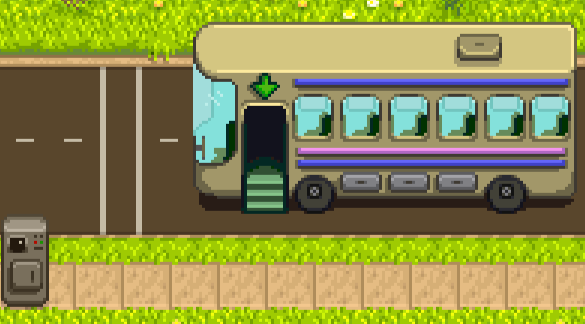

**Central Station** lets players travel to other mods' destinations by boat, bus, or train through the Central Station.

Mod authors can add custom destinations with optional ticket prices, and add ticket machines to their own maps using
map properties.

## Contents
* [For players](#for-players)
  * [Buy a ticket](#buy-a-ticket)
  * [Compatibility with other mods](#compatibility-with-other-mods)
* [For mod authors](#for-mod-authors)
  * [Add a stop](#add-a-stop)
  * [Add a ticket machine](#add-a-ticket-machine)
  * [Edit the railroad map](#edit-the-railroad-map)
* [See also](#see-also)

## For players
### Buy a ticket
To take the train, use the ticket machine at the railroad next to the station:  


To take the bus, use the ticket machine at the bus stop once the bus has been repaired and Pam is present:  


For the boat, use the ticket machine in [Willy's back room](https://stardewvalleywiki.com/Fish_Shop#Willy.27s_Boat)
once the boat has been repaired:  


Alternatively, you can take any of those routes to the Central Station and then switch to another line from there. For
example, take the bus to Central Station and then switch onto a boat to Ginger Island.

You can also interact with ticket machines in various mod locations.

### Compatibility with other mods
There are no known mod conflicts.

Central Station automatically shows stops added through the Bus Locations and Train Station mods if they're installed
too.

## For mod authors
### Add a stop
To add a boat, bus, or train stop:

1. Create a [Content Patcher content pack](https://stardewvalleywiki.com/Modding:Content_Patcher) if you don't already
   have one.
2. In your `content.json`, add entries to the `Mods/Pathoschild.CentralStation/Stops` asset:
   ```js
   {
       "Action": "EditData",
       "Target": "Mods/Cherry.TrainStation/Destinations",
       "Entries": {
           "{{ModId}}_ClintShop": {
               "DisplayName": "Clint's Shop",
               "ToLocation": "Town",
               "Networks": [ "Train" ],
               "ToTile": { "X": 105, "Y": 80 }
           }
       }
   }
   ```
3. Edit the data accordingly (see the fields below). You can list any number of boat or train stops in the same
   `EditData` patch.

The available fields for a boat or train stop are:

field name          | usage
------------------- | -----
_key_               | The entry key (not a field) is a [unique string ID](https://stardewvalleywiki.com/Modding:Common_data_field_types#Unique_string_ID) for your destination. This must be prefixed with your unique mod ID like `{{ModId}}_`.
`DisplayName`       | The display name to show in the menu. This should usually be translated into the player's current language using Content Patcher's `i18n` token.
`ToLocation`        | The internal name of the location to which the player should be warped to. You can see internal location names in-game using [Debug Mode](https://www.nexusmods.com/stardewvalley/mods/679).
`ToTile`            | <p>_(Optional)_ The tile position to which the player should be warped to. You can see tile coordinates in-game using [Debug Mode](https://www.nexusmods.com/stardewvalley/mods/679).</p><p>If omitted, Central Station will place the player just south of the ticket machine (if present), else it'll use the [default arrival tile](https://stardewvalleywiki.com/Modding:Maps#Warps_.26_map_positions).</li></ul>
`ToFacingDirection` | _(Optional)_ The direction the player should face after warping. The possible values are `up`, `down`, `left`, and `right`. Default `down`.
`Networks`           | _(Optional)_ How the player can reach the stop. This can be an array containing any combination of `Train` (default), `Boat`, and `Bus`.
`Cost`              | _(Optional)_ The gold price to purchase a ticket. Default free.
`Conditions`        | _(Optional)_ If set, the [game state query](https://stardewvalleywiki.com/Modding:Game_state_queries) which must be met for the destination to appear in the menu.
`DisplayNameFromCentralStation` | _(Optional)_ If set, overrides `DisplayName` when shown in Central Station's combined menu. This is only needed if a destination name is reused for different transport networks (e.g. "Stardew Valley" for boat, bus, and train stops).

### Add a ticket machine
You can add an [`Action` map property](https://stardewvalleywiki.com/Modding:Maps#Action) wherever you want the player
to get tickets. This can be a ticket machine, counter, or anything else thematically appropriate for your location.

The format is:
```
Action CentralStation [network]
```

The `[network]` must be `Boat`, `Bus`, `Train`, or omitted to default to `Train`. This indicates what line the player is on, which also affects
which destinations are available in the menu.

### Edit the railroad map
Central Station automatically adds a train ticket machine to `Maps/Railroad` on tile (32, 40).

If you edit the layout of that map, you can optionally add the ticket machine yourself. Central Station won't re-add
the machine if the `Action: TrainTickets` tile property is already present, and it'll automatically adjust its train
stop to match the position of the ticket machine.

## See also
* [Release notes](release-notes.md)
